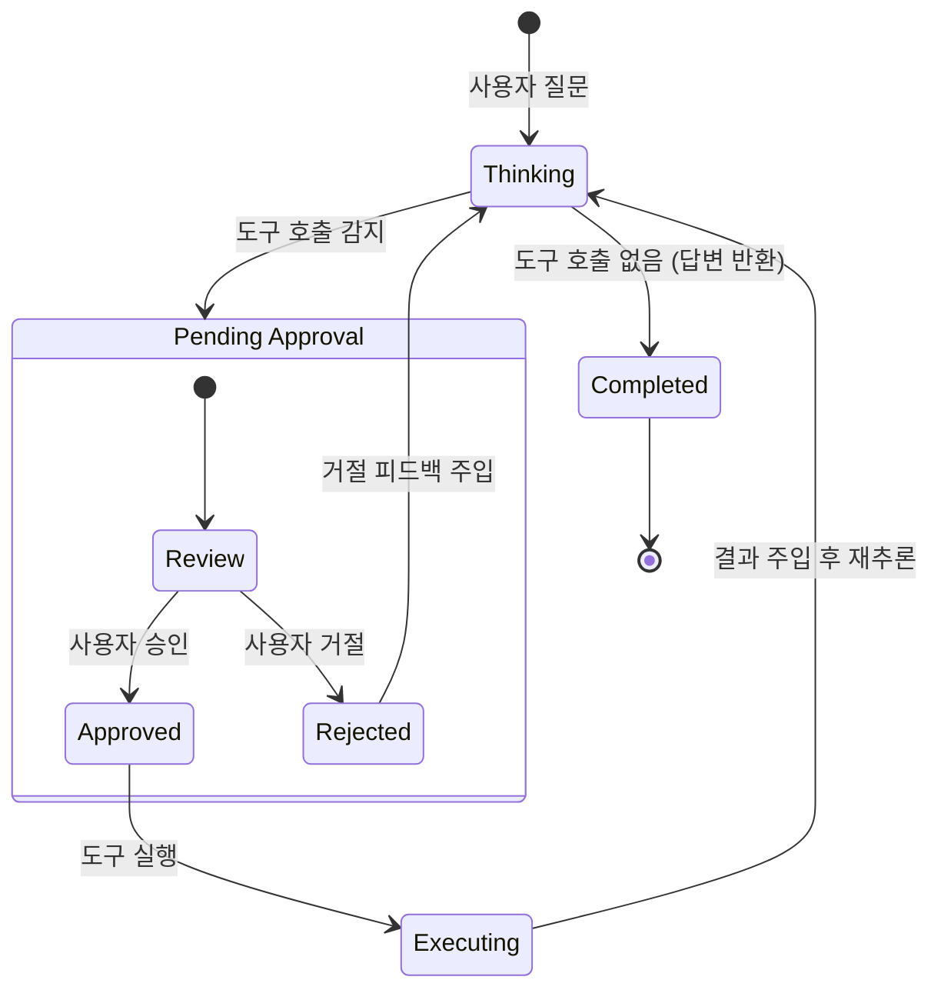

# Agent Loop API 기술 명세서 (Technical Specification)

본 문서는 `agent_loop_api` 시스템에 적용된 핵심 기술 스택과 아키텍처 패턴인 **Human-in-the-Loop (HITL)**에 대해 상세히 기술합니다.

---

## 1. 기술 스택 (Technology Stack)

### 1-1. 코어 프레임워크 (Backend)
- **Language**: Python 3.12+
- **Web Framework**: **FastAPI**
    - 선택 이유: 비동기 처리(`async`/`await`) 지원, 자동 API 문서화(Swagger UI), 높은 성능, Pydantic과의 강력한 결합.
- **Server**: **Uvicorn** (ASGI Server)
    - 특징: Graceful Shutdown 지원, 비동기 I/O 처리에 최적화.

### 1-2. 데이터 관리 (Data Layer)
- **Database**: **SQLite**
    - 선택 이유: 서버 내장형(Embedded), 설치 불필요, 에이전트 로그 및 경량 데이터 처리에 적합.
    - 주요 테이블: `pending_requests` (승인 대기), `employees` (비즈니스 데이터).
- **ORM**: Raw SQL + Pydantic
    - 복잡한 ORM 대신 직관적인 SQL 쿼리와 Pydantic 모델을 사용하여 데이터 유효성을 검증합니다.

### 1-3. LLM 인터페이스
- **Client**: `httpx` (Async HTTP Client)
- **Provider**: **Ollama** (Local LLM) / OpenAI API Compatible
- **Pattern**: **Function Calling (Tool Use)**
    - LLM에게 도구 정의(JSON Schema)를 제공하고, LLM이 도구 실행이 필요할 때 JSON을 반환하는 방식.

---

## 2. 아키텍처 패턴: Human-in-the-Loop (HITL)

**Human-in-the-Loop (HITL)**은 AI 시스템의 의사결정 과정에 인간이 직접 개입하여 통제권을 행사하는 디자인 패턴입니다. 본 프로젝트에서는 **"승인 기반 도구 실행(Approval-based Tool Execution)"** 모델을 채택했습니다.

### 2-1. 도입 배경
완전 자율 에이전트(Autonomous Agent)는 강력하지만 다음과 같은 위험이 있습니다:
- **환각(Hallucination)**으로 인한 잘못된 도구 실행
- **데이터 삭제/수정** 등 비가역적인 작업 수행
- **보안 위협**: 검증되지 않은 외부 API 호출

### 2-2. 적용 방식 (Asynchronous Approval Workflow)
본 시스템은 일반적인 동기식(Synchronous) 대화가 아닌, 승인을 위한 **비동기 상태 머신**을 구현했습니다.

1.  **Thinking & Proposal**: 에이전트(LLM)가 사용자의 의도를 파악하고 도구 실행을 **제안**합니다. (실행 X)
2.  **Suspension (일시 중지)**: 서버는 도구 호출을 감지하면 즉시 프로세스를 중단하고 상태를 `PENDING`으로 저장합니다.
3.  **Notification & Review**: 클라이언트는 승인 대기 상태임을 통보받고, 도구 이름과 인자(Arguments)를 검토합니다.
4.  **Human Decision**: 사용자가 승인(`APPROVE`) 또는 거절(`REJECT`)을 결정합니다.
5.  **Execution & Resume**: 서버는 결정에 따라 도구를 실행하거나 중단하고, 결과를 포함하여 프로세스를 **재개**합니다.

### 2-3. 상태 전이 다이어그램 (State Machine)



---

## 3. 핵심 구현 요소 (Implementation Details)

### 3-1. Graceful Shutdown
안정적인 서버 운영을 위해 종료 시그널(`SIGINT`, `SIGTERM`)을 감지하여 실행 중인 리소스(소켓 포트)를 안전하게 해제합니다.
```python
# Uvicorn with Graceful Shutdown
config_uvicorn = uvicorn.Config(..., timeout_graceful_shutdown=5)
server = uvicorn.Server(config_uvicorn)
```

### 3-2. Request Independence (요청 독립성)
각 요청은 고유한 `request_id`를 가지며, 메모리와 DB에서 독립적으로 관리됩니다. 이를 통해 다수의 클라이언트가 동시에 승인 요청을 보내더라도 충돌 없이 처리 가능합니다.

### 3-3. 표준 호환성
- **OpenAI API Specification**: 요청/응답 형식을 OpenAI API 규격에 맞춰 기존 클라이언트 도구와의 호환성을 유지했습니다.
- **RESTful Design**: 자원(Resource) 기반의 URL 설계 (`/v1/pending`, `/v1/approve/{id}`).
