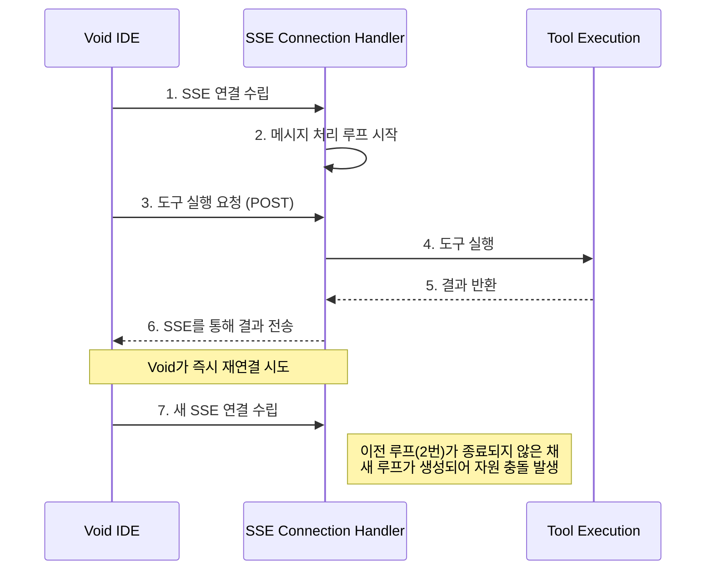
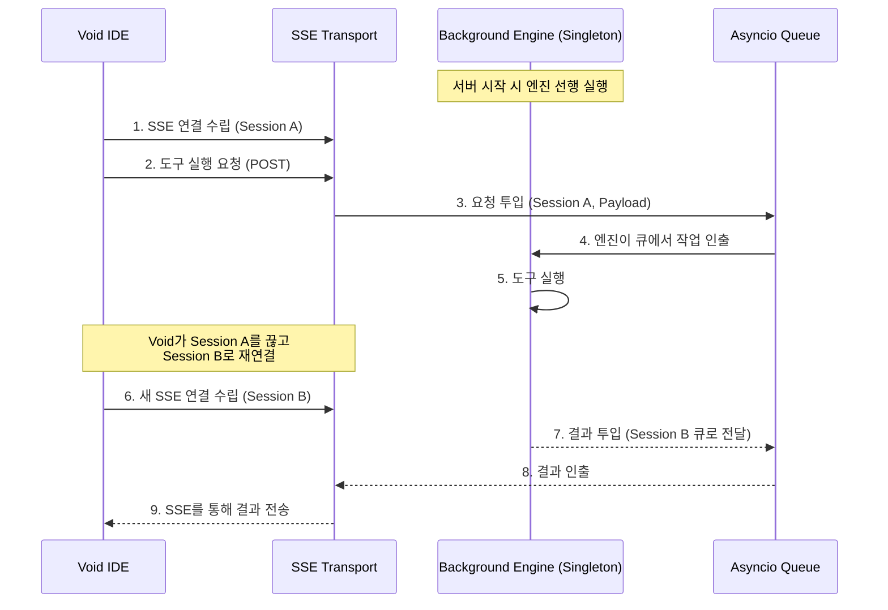

# MCP 서버 아키텍처 기술 비교 분석

본 문서는 Void IDE의 특이적인 연결 동작(빈번한 재연결)에 대응하기 위해 적용된 MCP 서버의 아키텍처 변화를 기술적으로 분석합니다.

---

## 1. 기존 방식 (Naive Connection-based)

기존 방식은 SSE 연결이 수립될 때마다 해당 연결 내에서 메시지 처리 루프가 생성되는 구조였습니다.

### 🔄 데이터 흐름 (기존)


### ❌ 문제점
- **자원 경합 (Race Condition)**: Void가 이전 연결을 완전히 닫기 전에 새 연결을 맺으면, 동일한 도구 엔진이나 DB 자원에 두 개의 루프가 동시에 접근하려 함.
- **상태 불안정**: 연결 생명주기와 작업 생명주기가 결합되어 있어, 연결이 끊기면 진행 중이던 작업의 결과를 전달할 방법이 모호해짐.

---

## 2. 개선된 방식 (Engine-Separated Architecture)

개선된 방식은 **작업 처리 엔진(Engine)**과 **통신 계층(Transport)**을 완전히 분리하고, 비동기 큐(Queue)를 통해 데이터를 주고받습니다.

### 🔄 데이터 흐름 (개선)


### ✅ 기술적 이점
1. **생명주기 분리 (Decoupling)**:
    - **Engine**: 서버와 함께 시작되어 단 하나만 존재 (Singleton).
    - **Transport**: 클라이언트 연결에 따라 생성/소멸.
    - 연결이 수만 번 재시도되어도 엔진은 영향을 받지 않고 안정적으로 작업을 처리합니다.

2. **비동기 큐 기반 라우팅**:
    - 엔진은 요청이 어느 세션에서 왔는지(`session_id`)만 식별하여 결과를 해당 세션의 출력 큐에 넣습니다.
    - 클라이언트가 재연결되어 세션 ID가 갱신되어도, 엔진은 큐에 쌓인 순서대로 작업을 처리하므로 데이터 유실이나 충돌이 없습니다.

3. **안정적인 자원 점유**:
    - 도구 실행(DB 접근 등)은 오직 엔진 루프 안에서만 순차적으로 일어나므로, 파일 락(File Lock)이나 DB 충돌 이슈가 원천 차단됩니다.

---

## 3. 핵심 코드 비교

### [기존] 연결 내 루프
```python
@app.get("/sse")
async def sse_connect():
    async def event_generator():
        while True: # 연결마다 루프 생성 (위험)
            msg = await get_message()
            yield msg
```

### [개선] 엔진-큐 분리
```python
# 전역 엔진 (단 하나만 실행)
class McpEngine:
    async def run(self):
        while True:
            task = await self.input_queue.get() # 큐에서 순차 처리
            process(task)

# 통신 계층 (연결만 관리)
@app.get("/sse")
async def sse_connect():
    async def event_generator():
        while True:
            msg = await session_queue.get() # 엔진이 준 결과만 전송
            yield msg
```
