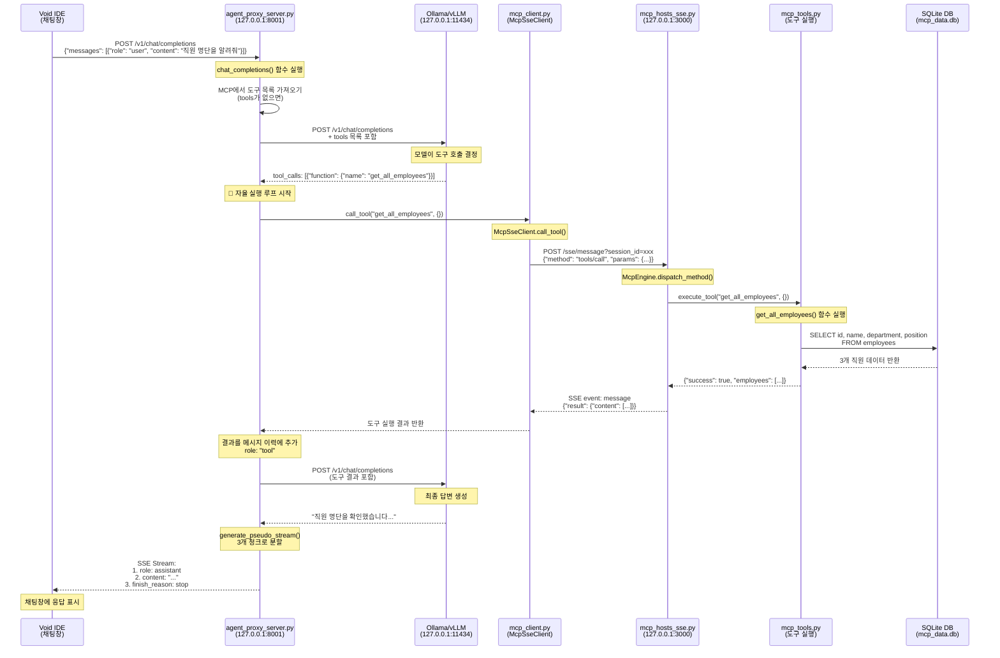

# MCP 질문 처리 흐름도

"직원 명단을 알려줘" 질문이 Void IDE에서 최종 응답까지 처리되는 전체 흐름을 상세히 설명합니다.

## 전체 흐름 다이어그램



## 상세 단계별 흐름

### 1️⃣ Void IDE → Agent Proxy Server

**파일**: `agent_proxy/agent_proxy_server.py`  
**함수**: `chat_completions()` (118행)

```python
@app.post("/v1/chat/completions")
async def chat_completions(request: ChatRequest):
    # 요청 수신
    request_id = datetime.now().strftime("%H%M%S")
    current_messages = [msg.model_dump(exclude_none=True) for msg in request.messages]
```

**요청 데이터**:
```json
{
  "messages": [
    {"role": "user", "content": "직원 명단을 알려줘"}
  ],
  "stream": true
}
```

---

### 2️⃣ Agent Proxy → MCP Server (도구 목록 가져오기)

**파일**: `agent_proxy/agent_proxy_server.py`  
**함수**: `chat_completions()` (130-152행)

```python
# 도구 자동 검색
if not tools:
    mcp_tools_resp = await httpx.AsyncClient().get(f"{config['mcp']['host']}/tools")
    tools = [...]  # MCP 형식 → OpenAI 형식 변환
```

**요청**: `GET http://127.0.0.1:3000/tools`  
**응답**: 4개 도구 정의 (search_docs, get_employee_info, get_all_employees, calculate_vacation_days)

---

### 3️⃣ Agent Proxy → LLM (첫 번째 호출)

**파일**: `agent_proxy/agent_proxy_server.py`  
**함수**: `call_llm()` (277행)

```python
async def call_llm(messages: List[Dict], tools: Optional[List] = None):
    url = f"{config['llm']['base_url']}/chat/completions"
    payload = {
        "model": config["llm"]["model"],
        "messages": messages,
        "tools": tools,
        "stream": False
    }
    resp = await client.post(url, json=payload, headers=headers)
```

**요청**: `POST http://127.0.0.1:11434/v1/chat/completions`  
**응답**:
```json
{
  "choices": [{
    "message": {
      "role": "assistant",
      "content": "",
      "tool_calls": [{
        "id": "call_0_1939",
        "function": {
          "name": "get_all_employees",
          "arguments": "{}"
        }
      }]
    }
  }]
}
```

---

### 4️⃣ Agent Proxy → MCP Client (도구 실행 요청)

**파일**: `agent_proxy/agent_proxy_server.py`  
**함수**: 자율 실행 루프 (233-255행)

```python
for tool_call in tool_calls:
    func_name = tool_call["function"]["name"]  # "get_all_employees"
    args = json.loads(tool_call["function"]["arguments"])  # {}
    
    # MCP 서버 호출
    result = await mcp_client.call_tool(func_name, args)
```

---

### 5️⃣ MCP Client → MCP Server (SSE 통신)

**파일**: `agent_proxy/mcp_client.py`  
**함수**: `call_tool()` (98행)

```python
async def call_tool(self, tool_name: str, arguments: Dict[str, Any]):
    msg_id = int(asyncio.get_event_loop().time() * 1000)
    payload = {
        "jsonrpc": "2.0",
        "method": "tools/call",
        "params": {
            "name": tool_name,
            "arguments": arguments
        },
        "id": msg_id
    }
    
    url = f"{self.host}/sse/message?session_id={self.session_id}"
    resp = await self._client.post(url, json=payload)
    
    # SSE 스트림에서 결과 대기
    result_msg = await asyncio.wait_for(self._response_queues[msg_id].get(), timeout=20.0)
```

**요청**: `POST http://127.0.0.1:3000/sse/message?session_id=xxx`

---

### 6️⃣ MCP Server → Engine (요청 처리)

**파일**: `mcp_server/mcp_hosts_sse.py`  
**함수**: `sse_message()` (253행) → `McpEngine.run()` (59행)

```python
@app.post("/sse/message")
async def sse_message(request: Request):
    session_id = request.query_params.get("session_id")
    payload = await request.json()
    
    # 엔진 입력 큐에 작업 추가
    await engine.input_queue.put({
        "session_id": session_id,
        "payload": payload
    })
```

**Engine 처리**:
```python
async def run(self):
    while self.is_running:
        request_data = await self.input_queue.get()
        method = payload.get("method")  # "tools/call"
        
        # 실제 도구 실행
        result = await self.dispatch_method(method, payload.get("params", {}))
```

---

### 7️⃣ Engine → MCP Tools (도구 실행)

**파일**: `mcp_server/mcp_hosts_sse.py`  
**함수**: `dispatch_method()` (102행)

```python
async def dispatch_method(self, method: str, params: Dict[str, Any]):
    if method == "tools/call":
        raw_result = execute_tool(params.get("name"), params.get("arguments", {}))
        return {
            "content": [{
                "type": "text",
                "text": json.dumps(raw_result, ensure_ascii=False)
            }]
        }
```

---

### 8️⃣ MCP Tools → Database

**파일**: `mcp_server/mcp_tools.py`  
**함수**: `execute_tool()` (337행) → `get_all_employees()` (289행)

```python
def execute_tool(tool_name: str, arguments: Dict[str, Any]):
    if tool_name not in TOOL_REGISTRY:
        return {"success": False, "error": f"알 수 없는 도구: {tool_name}"}
    
    result = TOOL_REGISTRY[tool_name](**arguments)  # get_all_employees()
    return result

def get_all_employees():
    conn = sqlite3.connect(DB_PATH)
    cursor = conn.cursor()
    
    cursor.execute("""
        SELECT id, name, department, position 
        FROM employees
    """)
    
    rows = cursor.fetchall()
    employees = [
        {"id": row[0], "name": row[1], "department": row[2], "position": row[3]}
        for row in rows
    ]
    
    return {
        "success": True,
        "count": len(employees),
        "employees": employees
    }
```

**DB 쿼리 결과**:
```json
{
  "success": true,
  "count": 3,
  "employees": [
    {"id": "EMP001", "name": "김철수", "department": "개발팀", "position": "주니어 개발자"},
    {"id": "EMP002", "name": "이영희", "department": "인사팀", "position": "대리"},
    {"id": "EMP003", "name": "박민수", "department": "개발팀", "position": "인턴"}
  ]
}
```

---

### 9️⃣ 결과 역순 전달 (MCP Tools → Agent Proxy)

**경로**: Tools → Engine → MCP Server (SSE) → MCP Client → Agent Proxy

**파일**: `mcp_server/mcp_hosts_sse.py` (Engine의 `run()` 함수, 89-92행)

```python
# 해당 세션의 출력 큐로 결과 전달
if session_id in self.sessions:
    await self.sessions[session_id].put(response)
```

**SSE 이벤트**:
```
event: message
data: {"jsonrpc": "2.0", "result": {"content": [...]}, "id": 123}
```

---

### 🔟 Agent Proxy → LLM (두 번째 호출 - 최종 답변 생성)

**파일**: `agent_proxy/agent_proxy_server.py`  
**함수**: 자율 실행 루프 (248-255행)

```python
# 도구 실행 결과를 메시지 이력에 추가
current_messages.append({
    "role": "tool",
    "tool_call_id": call_id,
    "content": json.dumps(result, ensure_ascii=False)
})

# 다시 LLM 호출 (루프의 처음으로)
full_ollama_resp = await call_llm(current_messages, tools)
```

**LLM 응답**:
```json
{
  "choices": [{
    "message": {
      "role": "assistant",
      "content": "직원 명단을 확인했습니다. 다음은 직원 목록입니다:\n\n- 김철수 (개발팀, 주니어 개발자)\n- 이영희 (인사팀, 대리)\n- 박민수 (개발팀, 인턴)"
    },
    "finish_reason": "stop"
  }]
}
```

---

### 1️⃣1️⃣ Agent Proxy → Void IDE (스트리밍 응답)

**파일**: `agent_proxy/agent_proxy_server.py`  
**함수**: `generate_pseudo_stream()` (304행)

```python
def generate_pseudo_stream(final_resp: Dict):
    # 첫 번째 청크: role
    yield f"data: {json.dumps(chunk1)}\\n\\n"
    
    # 두 번째 청크: content
    yield f"data: {json.dumps(chunk2)}\\n\\n"
    
    # 세 번째 청크: finish_reason
    yield f"data: {json.dumps(chunk3)}\\n\\n"
    yield "data: [DONE]\\n\\n"
```

**SSE 스트림**:
```
data: {"choices":[{"delta":{"role":"assistant"}}]}

data: {"choices":[{"delta":{"content":"직원 명단을 확인했습니다..."}}]}

data: {"choices":[{"delta":{},"finish_reason":"stop"}]}

data: [DONE]
```

---

### 1️⃣2️⃣ Void IDE (최종 렌더링)

Void IDE가 SSE 스트림을 수신하여 채팅창에 메시지를 점진적으로 표시합니다.

**최종 화면**:
```
직원 명단을 확인했습니다. 다음은 직원 목록입니다:

- 김철수 (개발팀, 주니어 개발자)
- 이영희 (인사팀, 대리)
- 박민수 (개발팀, 인턴)
```

---

## 핵심 포인트 정리

### 🔄 자율 실행 루프 (Agent Proxy의 핵심)
1. LLM이 도구 호출 요청
2. Agent Proxy가 **자동으로** MCP 서버 호출
3. 결과를 받아 다시 LLM에게 전달
4. LLM이 최종 답변 생성할 때까지 반복

### 📡 SSE (Server-Sent Events) 통신
- **MCP Client ↔ MCP Server**: 양방향 통신 (요청/응답)
- **Agent Proxy ↔ Void IDE**: 단방향 스트리밍 (서버 → 클라이언트)

### 🗄️ 데이터 저장소
- **mcp_data.db**: 직원 정보, 문서, 휴가 데이터
- **agent_proxy_data.db**: 에이전트 활동 로그

### ⚙️ 설정 파일
- **agent_proxy_config.json**: LLM 프로파일, MCP 호스트, 포트 설정
- **mcp_config.json**: MCP 서버 포트, DB 경로 설정
