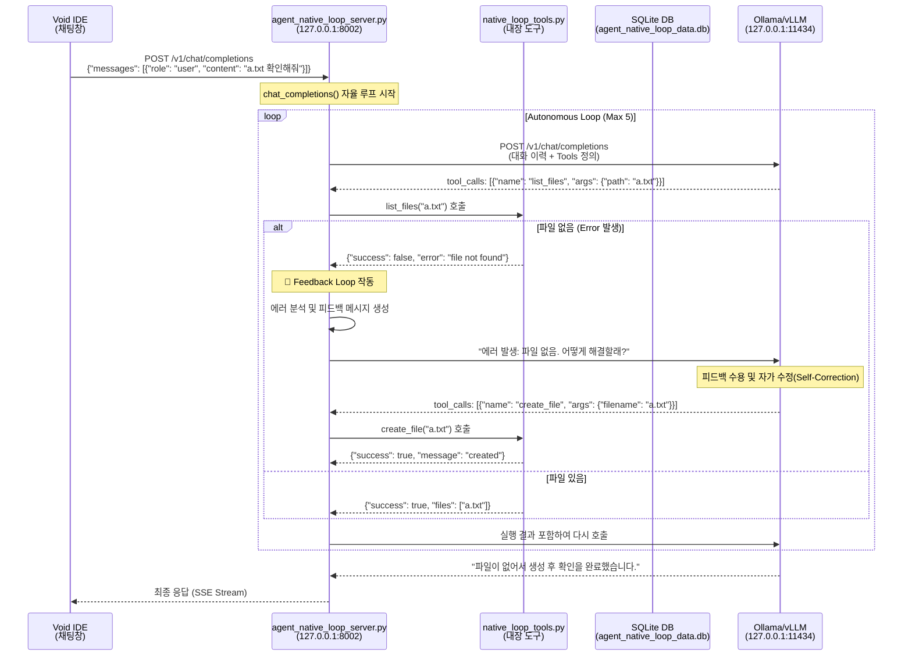

# 질문_native_loop_흐름도 (Flowchart)

이 문서는 사용자의 질문이 입력된 후, 에이전트가 도구를 호출하고 오류 발생 시 피드백 루프를 통해 자율적으로 문제를 해결하는 전체 과정을 상세히 설명합니다.

---

## 1. 전체 흐름 다이어그램

---

## 2. 상세 단계별 흐름

### 1️⃣ Void IDE → Agent Loop Server
- **파일**: `agent_native_loop/agent_native_loop_server.py`
- **엔드포인트**: `POST /v1/chat/completions` (Port: 8002)
- 사용자의 요청을 수신하고 `chat_completions` 함수에서 자율 실행 루프를 시작합니다.

### 2️⃣ LLM Native Tool Calling (추론 단계)
- 서버는 `native_loop_tools.py`에 정의된 도구 목록(`NATIVE_TOOL_DEFS`)을 LLM에게 보냅니다.
- LLM은 현재 질문을 해결하기 위해 어떤 도구가 필요한지 판단합니다.

### 3️⃣ Truly Native Loop (직접 실행)
- **로컬 호출**: LLM이 요청한 도구를 외부 서버 경유 없이 서버 내부의 파이썬 함수로 즉시 매핑하여 실행합니다.
- **성능**: 네트워크 오버헤드가 없으며, `agent_native_loop_data.db`에 활동 내역을 즉시 기록합니다.

### 4️⃣ 피드백 루프 및 자가 수정 (핵심 엔진)
- **오류 감지**: 도구 실행 결과가 `success: False`인 경우 피드백 루프가 트리거됩니다.
- **피드백 주입**: 서버는 LLM에게 단순 실패가 아닌, **"도구 실행 중 오류가 발생했습니다: [내용]. 원인을 분석하고 필요한 경우 수정된 인자로 다시 시도하거나 다른 방법을 찾아주세요."**라는 가이드를 전달합니다.
- **자가 수정(Self-Correction)**: LLM은 이 피드백을 바탕으로 자신의 실수를 인지하고, 도구 인자를 수정하거나(예: `ls` -> `create_file`) 새로운 전략을 세워 재시도합니다.

### 5️⃣ 최종 응답 반환
- 모든 도구 실행 결과가 수집되고 LLM이 최종 답변을 확정하면, 서버는 이를 SSE(Server-Sent Events) 스트림 형식으로 변환하여 Void IDE로 전송합니다.

---

## 3. 피드백 루프 실제 사례: `ls a.txt` 케이스

사용자님께서 질문하신 "파일이 없으면 만들어서 해결하는 과정"이 바로 피드백 루프의 정수입니다.

> **상황**: LLM이 `list_files(path="a.txt")`를 호출했으나 파일이 존재하지 않는 경우

1.  **1단계 (LLM 요청)**: "a.txt 파일이 있는지 확인해줘." (`list_files` 호출)
2.  **2단계 (서버 에러)**: 서버가 실행했으나 파일이 없음 → `{"success": false, "error": "file not found"}` 반환.
3.  **3단계 (피드백 루프)**: 서버는 LLM에게 **"에러가 났어. 어떻게 할래? 파일을 만들어야 할까, 아니면 다른 파일이 있는지 찾아볼까?"**라고 다시 주입합니다.
4.  **4단계 (자가 수정)**: LLM은 피드백을 보고 판단합니다. "아, 파일이 없구나. 그럼 나한테 `create_file` 도구가 있으니까 이걸로 만들고 다시 확인해야겠다!"
5.  **5단계 (성공)**: LLM이 `create_file("a.txt")`를 호출하여 문제를 해결합니다.

> [!IMPORTANT]
> 여기서 **`create_file`은 '도구'**이고, 에러를 보고 "아, 그럼 파일을 만들어야겠네!"라고 **생각을 바꿔서 다시 시도하는 과정이 '피드백 루프'**입니다.

---

## 4. 핵심 구성 파일 비교

| 파일명 | 역할 | 비고 |
| :--- | :--- | :--- |
| **agent_native_loop_server.py** | 자율 루프 및 피드백 엔진 | 포트 8002 |
| **native_loop_tools.py** | 직접 실행 도구 정의 | `create_file`, `list_files` 포함 |
| **agent_native_loop_config.json** | 시스템 설정 | LLM 및 포트 설정 |
| **agent_native_loop_data.db** | 활동 및 피드백 로그 | 자가 수정 과정 추적 |
