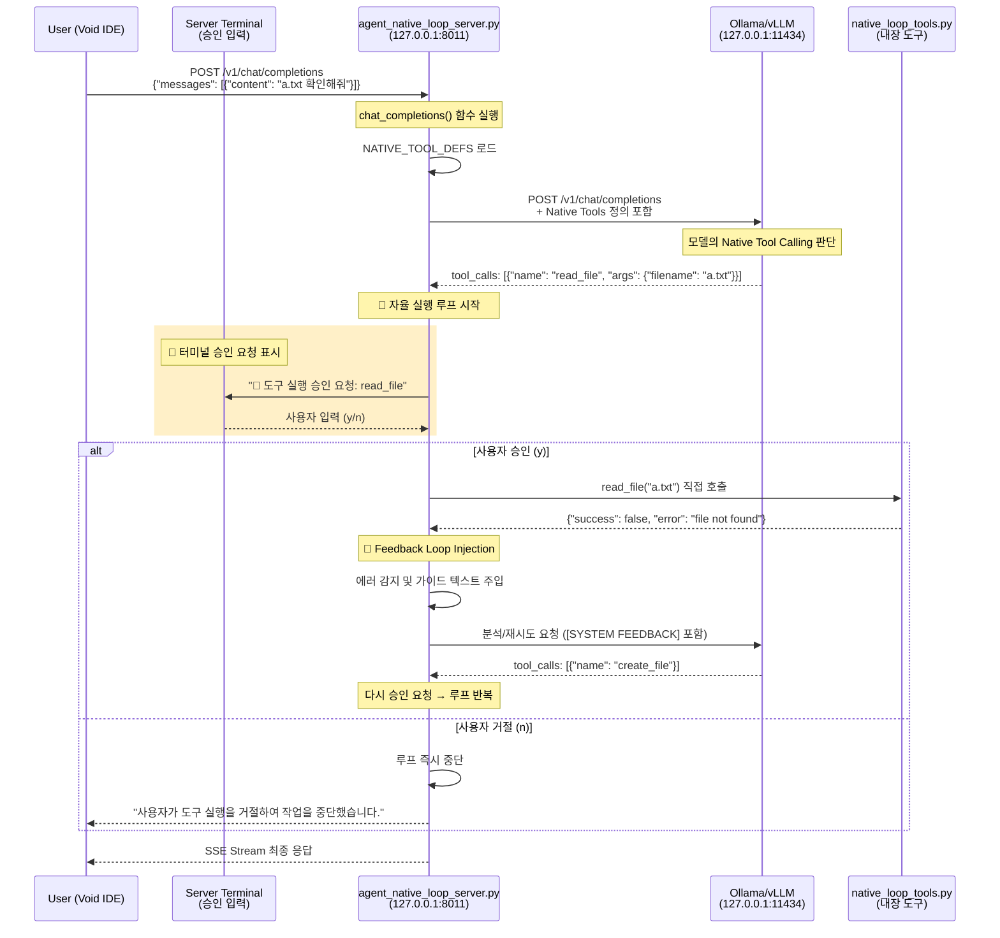

# Native Loop 에이전트 질문 처리 흐름도 (Human-in-the-Loop 버전)

"a.txt 확인해줘" 질문이 Void IDE에서 `agent_native_loop`를 거쳐 최종 응답까지 처리되는 전체 흐름을 상세히 설명합니다. `agent_native_loop`는 **터미널 기반 승인 시스템**을 통해 도구 실행 전 사용자의 명시적 승인을 요구합니다.

## 전체 흐름 다이어그램



---

## 상세 단계별 흐름

### 1️⃣ Void IDE → Agent Loop Server

**파일**: `agent_native_loop/agent_native_loop_server.py`  
**함수**: `chat_completions()` (160-304행)  
**설명**: 사용자 요청을 수신하고 자율 실행 루프를 시작합니다.

```python
@app.post("/v1/chat/completions")
async def chat_completions(request: ChatRequest):
    request_id = datetime.now().strftime("%H%M%S")
    logger.info(f"[Agent-{request_id}] New request received: {request.messages[-1].content}")
    save_agent_log(request_id, "Request Received", request.messages[-1].content)
    
    current_messages = [msg.model_dump(exclude_none=True) for msg in request.messages]
    tools = request.tools if request.tools else NATIVE_TOOL_DEFS
```

---

### 2️⃣ 도구 목록 로드 (Loading Native Tools)

**파일**: `agent_native_loop/native_loop_tools.py`  
**변수**: `NATIVE_TOOL_DEFS`, `NATIVE_TOOL_REGISTRY`  
**설명**: 서버 내부에 정의된 네이티브 도구 목록을 로드합니다.

```python
# native_loop_tools.py에서 정의된 도구들
NATIVE_TOOL_DEFS = [
    {"type": "function", "function": {"name": "read_file", ...}},
    {"type": "function", "function": {"name": "create_file", ...}},
    # ... 7개 도구
]
```

---

### 3️⃣ 터미널 승인 요청 (Human-in-the-Loop)

**파일**: `agent_native_loop/agent_native_loop_server.py`  
**함수**: `ask_terminal_approval()` (81-104행)  
**설명**: 도구 실행 전 터미널에서 사용자 승인을 요청합니다.

```python
async def ask_terminal_approval(func_name: str, args: Dict) -> bool:
    """터미널에서 도구 실행 승인을 요청합니다."""
    print("\n" + "="*60)
    print(f"🔧 도구 실행 승인 요청")
    print(f"   도구: {func_name}")
    print(f"   인자: {json.dumps(args, ensure_ascii=False, indent=2)}")
    print("="*60)
    
    # async 방식으로 input() 호출 (이벤트 루프 블로킹 방지)
    loop = asyncio.get_event_loop()
    user_input = await loop.run_in_executor(None, lambda: input("실행하시겠습니까? (y/n): "))
    
    approved = user_input.strip().lower() in ['y', 'yes', '예', 'ㅛ']
    return approved
```

**터미널 승인 화면 예시:**
```
============================================================
🔧 도구 실행 승인 요청
   도구: read_file
   인자: {
     "filename": "a.txt"
   }
============================================================
실행하시겠습니까? (y/n): _
```

---

### 4️⃣ 피드백 주입 (Feedback Loop Injection)

**파일**: `agent_native_loop/agent_native_loop_server.py`  
**함수**: `chat_completions()` (181-191행)  
**설명**: 도구 실행 결과가 에러일 경우, LLM이 자가 수정할 수 있도록 가이드를 주입합니다.

```python
if last_msg and last_msg.get("role") == "tool":
    content_obj = json.loads(last_msg.get("content", "{}"))
    if isinstance(content_obj, dict) and not content_obj.get("success", True):
        error_msg = content_obj.get("error", "Unknown error")
        feedback_guidance = f"\n\n[SYSTEM FEEDBACK]\n도구 실행 중 오류가 발생했습니다: {error_msg}\n원인을 분석하고 필요한 경우 수정된 인자로 다시 시도하거나 다른 방법을 찾아주세요."
        last_msg["content"] = last_msg.get("content", "") + feedback_guidance
```

---

### 5️⃣ LLM 호출 (Thinking)

**파일**: `agent_native_loop/agent_native_loop_server.py`  
**함수**: `call_llm()` (328-357행)  
**설명**: LLM(Ollama/vLLM)에게 추론 요청을 보냅니다.

```python
async def call_llm(messages: List[Dict], tools: Optional[List] = None):
    """LLM(Ollama, vLLM, OpenAI 등)의 OpenAI 호환 API 호출"""
    async with httpx.AsyncClient(timeout=config["llm"]["timeout"]) as client:
        url = f"{config['llm']['base_url']}/chat/completions"
        payload = {
            "model": config["llm"]["model"],
            "messages": messages,
            "stream": False,
            "temperature": 0
        }
        if tools:
            payload["tools"] = tools
        resp = await client.post(url, json=payload, headers=headers)
        return resp.json()
```

---

### 6️⃣ 스트리밍 응답 반환 (SSE Stream)

**파일**: `agent_native_loop/agent_native_loop_server.py`  
**함수**: `generate_pseudo_stream_hitl()` (359-402행)  
**설명**: LLM 응답을 OpenAI 호환 SSE 스트림으로 변환하여 클라이언트에게 전송합니다.

```python
if request.stream:
    return StreamingResponse(
        generate_pseudo_stream_hitl(final_response),
        media_type="text/event-stream"
    )
```

---

## 핵심 철학

1. **통제권은 사용자에게**: 어떤 행동(도구 실행)도 사용자의 명시적 승인 없이 이루어지지 않습니다.
2. **지능은 에이전트로부터**: 에러가 발생했을 때 해결책을 고민하는 고통은 에이전트가 대신하며, 사용자는 제안된 해결책을 검토하고 승인만 하면 됩니다.
3. **반복되는 자가 수정**: 사용자가 승인하는 한, 에이전트는 목표를 달성할 때까지 계속해서 학습하고 시도합니다.

---

## 파일별 주요 함수 및 소스 매핑

| 단계 | 파일명 | 함수/변수 | 라인 번호 |
| :--- | :--- | :--- | :--- |
| **요청 수신** | `agent_native_loop_server.py` | `chat_completions()` | 160행 |
| **도구 로드** | `agent_native_loop_server.py` | `NATIVE_TOOL_DEFS` | 171행 |
| **터미널 승인** | `agent_native_loop_server.py` | `ask_terminal_approval()` | 81-104행 |
| **피드백 주입** | `agent_native_loop_server.py` | Feedback Loop Injection | 181-191행 |
| **LLM 호출** | `agent_native_loop_server.py` | `call_llm()` | 328-357행 |
| **스트리밍** | `agent_native_loop_server.py` | `generate_pseudo_stream_hitl()` | 359-402행 |
| **도구 구현** | `native_loop_tools.py` | `read_file`, `create_file` 등 | 전체 |

---

## 테스트 방법

### 1️⃣ 서버 실행

터미널에서 `agent_native_loop` 디렉토리에서 서버를 실행합니다.

```bash
cd agent_native_loop
python agent_native_loop_server.py
```

서버가 정상 실행되면 다음 메시지가 표시됩니다:
```
Agent Native Loop Server starting (Truly Native Mode)...
7 native tools loaded
Uvicorn running on http://127.0.0.1:8011 (Press CTRL+C to quit)
```

---

### 2️⃣ API 테스트

> ⚠️ **중요**: 도구 호출 시 **서버 터미널**에서 `y` 또는 `n` 입력이 필요합니다!

#### **방법 A: Python 테스트 스크립트 (권장)**

별도 터미널에서 실행:
```bash
cd agent_native_loop
python test_request.py
```

#### **방법 B: CMD (명령 프롬프트)**

```cmd
curl.exe -X POST http://127.0.0.1:8011/v1/chat/completions -H "Content-Type: application/json" -d "{\"model\": \"qwen2.5-coder:7b\", \"messages\": [{\"role\": \"user\", \"content\": \"a.txt 확인해줘\"}], \"stream\": false}"
```

#### **방법 C: PowerShell**

PowerShell에서는 `curl`이 `Invoke-WebRequest`의 별칭이므로 다음 명령어를 사용합니다:

```powershell
# 방법 1: Invoke-RestMethod 사용 (권장)
$body = @{
    model = "qwen2.5-coder:7b"
    messages = @(@{role = "user"; content = "a.txt 확인해줘"})
    stream = $false
} | ConvertTo-Json -Depth 3

Invoke-RestMethod -Uri "http://127.0.0.1:8011/v1/chat/completions" -Method POST -Body $body -ContentType "application/json"
```

```powershell
# 방법 2: curl.exe 직접 호출
curl.exe -X POST http://127.0.0.1:8011/v1/chat/completions -H "Content-Type: application/json" -d "{\"model\": \"qwen2.5-coder:7b\", \"messages\": [{\"role\": \"user\", \"content\": \"a.txt 확인해줘\"}], \"stream\": false}"
```

---

### 3️⃣ 승인/거절 테스트

1. 테스트 요청을 보내면 **서버 터미널**에 승인 요청이 표시됩니다.
2. `y` 입력 → 도구가 실행되고 결과가 LLM에게 전달됩니다.
3. `n` 입력 → 도구 실행이 건너뛰어지고 루프가 종료됩니다.

**승인 시 예상 로그:**
```
============================================================
🔧 도구 실행 승인 요청
   도구: read_file
   인자: {
     "filename": "a.txt"
   }
============================================================
실행하시겠습니까? (y/n): y
✅ 승인됨 - 도구를 실행합니다.
```

**거절 시 예상 응답:**
```json
{
  "choices": [{
    "message": {
      "role": "assistant",
      "content": "사용자가 도구 실행을 거절하여 작업을 중단했습니다."
    }
  }]
}
```

---

### 4️⃣ 로그 확인

#### 4.1 텍스트 로그 파일 확인

**CMD:**
```cmd
type agent_native_loop\agent_native_loop.log
```

**PowerShell:**
```powershell
Get-Content agent_native_loop\agent_native_loop.log -Tail 20
```

#### 4.2 SQLite DB 로그 확인

```bash
sqlite3 agent_native_loop/agent_native_loop_config/agent_native_loop_data.db "SELECT * FROM agent_logs ORDER BY timestamp DESC LIMIT 5;"
```

**DB 로그 예시:**
| id | timestamp | request_id | message | details |
| :--- | :--- | :--- | :--- | :--- |
| 85 | 2026-01-14 19:25:00 | 192500 | Tool Executed: read_file | {"success": false, "error": "..."} |
| 84 | 2026-01-14 19:24:55 | 192500 | Request Received | a.txt 확인해줘 |

---

## 핵심 구성 파일

| 파일/디렉토리 | 설명 |
|---------------|------|
| `agent_native_loop_server.py` | 자율 실행 루프, 피드백 로직, HITL 승인 기능 포함 메인 엔진 |
| `native_loop_tools.py` | 에이전트가 사용하는 네이티브 도구 모음 (7개) |
| `agent_native_loop_config/` | 설정 파일 및 DB 저장 디렉토리 |
| `test_request.py` | API 테스트용 클라이언트 스크립트 |
