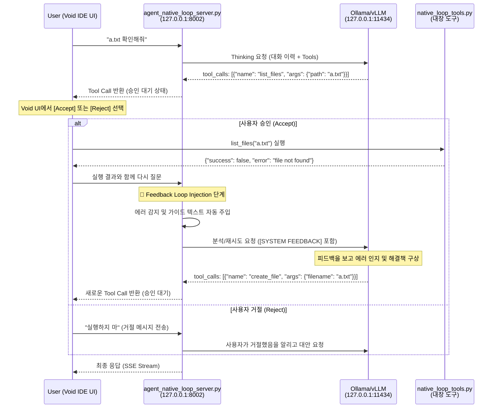

# 질문_native_loop_흐름도 (Human-in-the-Loop)

이 문서는 사용자가 도구 실행의 승인/거절(Accept/Reject)권을 가지며, 오류 발생 시 서버가 지능적으로 피드백을 주입하여 해결을 돕는 **수동 피드백 루프(HITL)** 과정을 설명합니다.

---

## 1. HITL 전체 흐름 다이어그램



---

## 2. 상세 단계별 흐름 (HITL)

### 1️⃣ LLM의 도구 선택 (Thinking)
- 사용자의 질문을 받은 서버는 LLM에게 어떤 도구를 쓸지 묻습니다.
- 서버 내부에서 자동 실행되던 이전 방식과 달리, 서버는 LLM이 선택한 **도구 호출 정보(`tool_calls`)를 그대로 사용자(Void IDE)에게 전달**합니다.

### 2️⃣ 사용자 승인 및 도구 실행 (Human Gate)
- Void IDE UI에는 `Accept` / `Reject` 버튼이 표시됩니다.
- 사용자(User)가 **`Accept`**를 클릭하면 로컬 환경에서 도구가 실행됩니다.

### 3️⃣ 지점: 피드백 주입 (Feedback Injection)
- **파일**: `agent_native_loop/agent_native_loop_server.py`
- **함수**: `chat_completions()` (137-154행)
- 도구 실행 결과가 **에러(`success: False`)**인 경우, 서버는 이를 가로채서 LLM에게 보낼 메시지에 다음과 같은 가이드를 자동으로 덧붙입니다.

```python
# 서버 내 주입 로직 예시
feedback_guidance = "\n\n[SYSTEM FEEDBACK]\n도구 실행 중 오류가 발생했습니다: {error_msg}\n원인을 분석하고 필요한 경우 수정된 인자로 다시 시도하거나 다른 방법을 찾아주세요."
```

### 4️⃣ LLM의 자가 수정 (Self-Correction)
- LLM은 사용자로부터 전달된 도구 에러 결과와 서버가 주입한 **[SYSTEM FEEDBACK]**을 함께 읽습니다.
- "아, 파일이 없구나. 그럼 만들어서 해결해야지"라고 판단하여 `create_file` 도구 호출을 다시 생성합니다.

---

## 3. 핵심 철학

1.  **통제권은 사용자에게**: 어떤 행동(도구 실행)도 사용자의 명시적 승인 없이 이루어지지 않습니다.
2.  **지능은 에이전트로부터**: 에러가 발생했을 때 해결책을 고민하는 고통은 에이전트가 대신하며, 사용자는 제안된 해결책을 검토하고 승인만 하면 됩니다.
3.  **반복되는 자가 수정**: 사용자가 승인하는 한, 에이전트는 목표를 달성할 때까지 계속해서 학습하고 시도합니다.

---

## 4. 파일별 주요 라인 정리

| 파일 | 주요 로직 | 라인 |
| :--- | :--- | :--- |
| **agent_native_loop_server.py** | 피드백 가이드 주입 (`if last_msg.get("role") == "tool":`) | 141-154행 |
| **agent_native_loop_server.py** | 스트리밍 처리 (`generate_pseudo_stream_hitl`) | 207-248행 |
| **native_loop_tools.py** | 파일 및 검색 도구 정의 | 19-110행 |

---

## 5. 테스트 방법

### 1️⃣ 서버 실행
터미널에서 `agent_native_loop` 디렉토리가 아닌 프로젝트 루트 디렉토리에서 다음 명령어를 실행합니다.
```bash
python3 agent_native_loop/agent_native_loop_server.py
```

### 2️⃣ API 테스트 (curl)
서버가 실행 중인 상태에서 새로운 터미널을 열고 다음 명령어를 실행하여 에이전트의 동작을 확인할 수 있습니다.
*주의: HITL 방식이므로 curl 대신 Void IDE 채팅창에서 직접 테스트하는 것이 실제 승인/거절 흐름을 확인하기에 더 좋습니다.*

```bash
curl http://localhost:8002/v1/chat/completions \
  -H "Content-Type: application/json" \
  -d '{
    "model": "qwen2.5-coder:7b",
    "messages": [{"role": "user", "content": "a.txt 확인해줘"}],
    "stream": false
  }'
```
