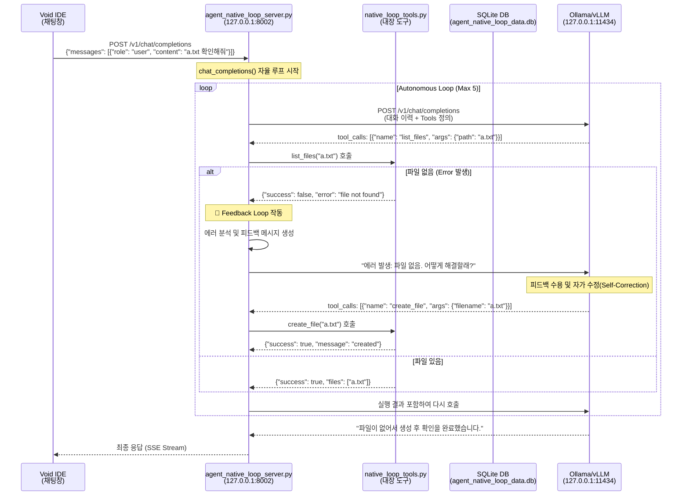

# 질문_native_loop_흐름도 (Flowchart)

이 문서는 사용자의 질문이 입력된 후, 에이전트가 도구를 호출하고 오류 발생 시 피드백 루프를 통해 자율적으로 문제를 해결하는 전체 과정을 기술적으로 상세히 설명합니다.

---

## 1. 전체 흐름 다이어그램



---

## 2. 상세 단계별 흐름

### 1️⃣ Void IDE → Agent Loop Server

**파일**: `agent_native_loop/agent_native_loop_server.py`  
**함수**: `chat_completions()` (123행)

```python
@app.post("/v1/chat/completions")
async def chat_completions(request: ChatRequest):
    # 요청 수신 및 로그 저장
    request_id = datetime.now().strftime("%H%M%S")
    logger.info(f"📥 [Agent-{request_id}] 새 요청 수신: {request.messages[-1].content}")
    save_agent_log(request_id, "Request Received", request.messages[-1].content)
    
    current_messages = [msg.model_dump(exclude_none=True) for msg in request.messages]
```

**요청 데이터**:
```json
{
  "messages": [
    {"role": "user", "content": "a.txt 확인해줘"}
  ],
  "stream": true
}
```

---

### 2️⃣ 도구 목록 로드 및 LLM 호출 준비

**파일**: `agent_native_loop/agent_native_loop_server.py`  
**함수**: `chat_completions()` (135-140행)

```python
# 도구 목록 로드 (로컬 native_tools 사용)
tools = request.tools
if not tools:
    logger.info(f"🔍 [Agent-{request_id}] 로컬 네이티브 도구 목록 사용 중...")
    tools = NATIVE_TOOL_DEFS # native_loop_tools.py에서 정의된 도구
```

---

### 3️⃣ 자율 실행 루프 (Autonomous Loop)

**파일**: `agent_native_loop/agent_native_loop_server.py`  
**함수**: `chat_completions()` (146-153행)

```python
# n8n 스타일의 상태 머신 루프
max_iterations = 5
for i in range(max_iterations):
    # status 1: Thinking
    logger.info(f"📤 [Agent-{request_id}] [LLM REQ] LLM에게 답변 요청 중...")
    full_ollama_resp = await call_llm(current_messages, tools)
```

---

### 4️⃣ LLM 응답 분석 및 JSON 추출 (Output Parsing)

**파일**: `agent_native_loop/agent_native_loop_server.py`  
**함수**: `chat_completions()` (165-206행)

Ollama와 같은 모델이 규격화된 `tool_calls` 대신 텍스트 내에 JSON으로 답변할 경우를 대비한 파싱 로직입니다.

```python
if not tool_calls and content:
    # 마크다운 코드 블록 제거 및 JSON 추출 시도
    if "{" in json_str and "}" in json_str:
        # 중괄호 범위를 찾아 JSON만 추출
        potential_tool = json.loads(json_str)
        if "name" in potential_tool and "arguments" in potential_tool:
            tool_calls = [{"function": potential_tool}]
```

---

### 5️⃣ 로컬 네이티브 도구 직접 실행 (Action)

**파일**: `agent_native_loop/agent_native_loop_server.py`  
**함수**: `chat_completions()` (243-254행)

**파일**: `agent_native_loop/native_loop_tools.py` (실제 구현부)

```python
# Server: 도구 매핑 및 실행
if func_name in NATIVE_TOOL_REGISTRY:
    result = NATIVE_TOOL_REGISTRY[func_name](**args)

# Tools: 실제 구현 예시 (list_files)
def list_files(path: str = ".") -> Dict[str, Any]:
    p = Path(path)
    if not p.exists():
        return {"success": False, "error": f"Path '{path}' does not exist"}
    files = [f.name for f in p.iterdir() if f.is_file()]
    return {"success": True, "files": files}
```

---

### 6️⃣ 피드백 루프 작동 (Feedback Loop)

**파일**: `agent_native_loop/agent_native_loop_server.py`  
**함수**: `chat_completions()` (260-276행)

도구 실행 실패 시 LLM에게 명시적인 피드백을 주어 자가 수정을 유도합니다.

```python
if not result.get("success", True):
    error_msg = result.get("error", "Unknown error")
    feedback_content = f"도구 실행 중 오류가 발생했습니다: {error_msg}\n원인을 분석하고 필요한 경우 수정된 인자로 다시 시도하거나 다른 방법을 찾아주세요."
    current_messages.append({
        "role": "tool",
        "tool_call_id": call_id,
        "content": json.dumps({"status": "error", "message": feedback_content}, ensure_ascii=False)
    })
```

---

### 7️⃣ 최종 응답 및 스트리밍 반환

**파일**: `agent_native_loop/agent_native_loop_server.py`  
**함수**: `generate_pseudo_stream()` (315행)

```python
def generate_pseudo_stream(final_resp: Dict):
    # OpenAI 규격의 SSE 스트림으로 변환하여 반환
    yield f"data: {json.dumps(chunk1, ensure_ascii=False)}\n\n"
    yield f"data: {json.dumps(chunk2, ensure_ascii=False)}\n\n"
    yield f"data: {json.dumps(chunk3, ensure_ascii=False)}\n\n"
    yield "data: [DONE]\n\n"
```

---

## 3. 핵심 구성 요소 요약

*   **자율성**: 사용자 개입 없이 최대 5회까지 스스로 생각하고 도구를 실행합니다.
*   **자가 수정**: 실패를 성공의 발판으로 삼아 전략을 수정하는 피드백 루프를 탑재했습니다.
*   **고성능**: 네트워크 지연 없이 서버 내에서 즉시 도구를 실행합니다.
