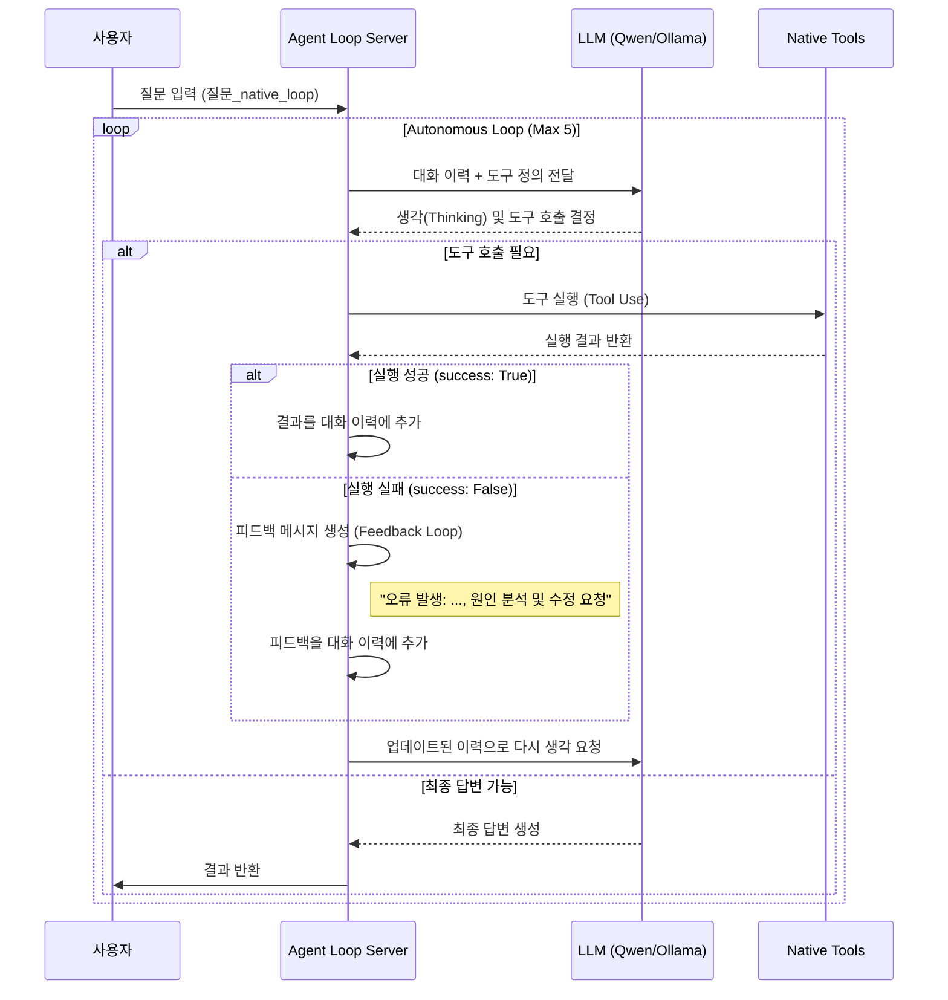

# 질문_native_loop_흐름도 (Flowchart)

이 문서는 사용자의 질문이 입력된 후, 에이전트가 도구를 호출하고 오류 발생 시 피드백 루프를 통해 자가 수정하는 과정을 설명합니다.



## 상세 단계별 흐름

### 1️⃣ Void IDE → Agent Loop Server
- **포트**: 8002
- 사용자의 질문을 수신하고 자율 실행 루프를 총괄합니다.

### 2️⃣ LLM Native Tool Calling (첫 번째 추론)
- `native_loop_tools.py`에 정의된 `NATIVE_TOOL_DEFS`를 LLM에게 전달하여 도구 사용 여부를 결정합니다.

### 3️⃣ Truly Native Loop & Feedback Loop (자율 실행 및 자가 수정)
- **로컬 실행**: LLM이 요청한 도구를 파이썬 함수로 즉시 매핑하여 실행합니다.
- **오류 감지 및 피드백**: 도구 실행 중 오류 발생 시, 멈추지 않고 오류 내용을 LLM에게 다시 전달하여 해결 방법을 찾도록 유도합니다.

---

## 핵심 구성 파일

- **agent_native_loop_server.py**: 에이전트 핵심 루프 및 피드백 로직 엔진
- **native_loop_tools.py**: LLM이 호출할 수 있는 로컬 파이썬 함수 정의 (자가 수정 테스트용 도구 포함)
- **agent_native_loop_config.json**: LLM 프로파일 및 에이전트 기본 포트(8002) 설정
- **agent_native_loop_data.db**: 에이전트 활동 및 피드백 이력 저장 DB

---

## 테스트 방법

### 1. 서버 실행
터미널에서 `agent_native_loop` 디렉토리로 이동한 후 서버를 실행합니다.
```bash
python agent_native_loop/agent_native_loop_server.py
```

### 2. API 테스트 (curl)
도구 실행 실패 시 피드백 루프가 작동하는지 확인하기 위해 의도적으로 에러를 발생시키는 테스트를 수행합니다.
```bash
curl -X POST http://localhost:8002/v1/chat/completions \
  -H "Content-Type: application/json" \
  -d '{
    "messages": [
      {"role": "user", "content": "force_error 도구를 사용해서 '\''연결 오류'\''라는 이유로 에러를 발생시켜줘. 그리고 그 에러를 네가 어떻게 해결하는지 보여줘."}
    ],
    "stream": false
  }'
```

### 3. 로그 및 DB 확인

#### 3.1 실시간 로그 모니터링
```bash
tail -f agent_native_loop/agent_native_loop.log
```

#### 3.2 SQLite DB 이력 확인
`agent_logs` 테이블에서 에이전트의 활동과 도구 호출 결과를 확인할 수 있습니다.
```bash
sqlite3 db/agent_native_loop_data.db "SELECT * FROM agent_logs ORDER BY id DESC LIMIT 5;"
```
