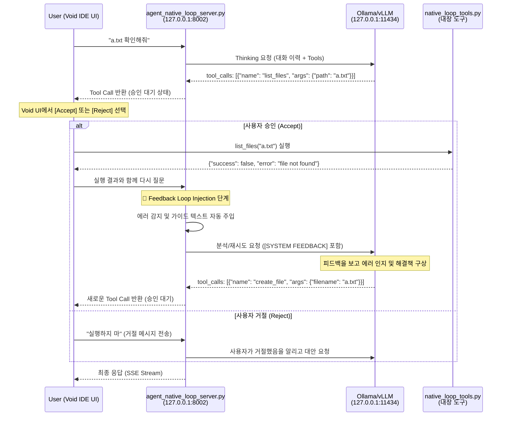

# 질문_native_loop_흐름도 (Human-in-the-Loop)

이 문서는 사용자가 도구 실행의 승인/거절(Accept/Reject)권을 가지며, 오류 발생 시 서버가 지능적으로 피드백을 주입하여 해결을 돕는 **수동 피드백 루프(HITL)** 과정을 상세히 설명합니다.

---

## 1. HITL 전체 흐름 다이어그램



---

## 2. 상세 단계별 흐름

### 1️⃣ Void IDE → Agent Loop Server

**파일**: `agent_native_loop/agent_native_loop_server.py`  
**함수**: `chat_completions()` (123-132행)

```python
@app.post("/v1/chat/completions")
async def chat_completions(request: ChatRequest):
    # 요청 수신 및 로그 저장
    request_id = datetime.now().strftime("%H%M%S")
    logger.info(f"📥 [Agent-{request_id}] 새 요청 수신: {request.messages[-1].content}")
    save_agent_log(request_id, "Request Received", request.messages[-1].content)
    
    current_messages = [msg.model_dump(exclude_none=True) for msg in request.messages]
```

---

### 2️⃣ 도구 목록 확인 (Loading Native Tools)

**파일**: `agent_native_loop/agent_native_loop_server.py`  
**함수**: `chat_completions()` (135행)

```python
# 도구 목록 로드 (로컬 native_tools 사용)
tools = request.tools if request.tools else NATIVE_TOOL_DEFS
```

---

### 3️⃣ 피드백 주입 (Feedback Loop Injection)

**파일**: `agent_native_loop/agent_native_loop_server.py`  
**함수**: `chat_completions()` (141-151행)

도구 실행 결과가 에러일 경우, LLM이 자가 수정을 할 수 있도록 가이드를 주입합니다.

```python
if last_msg and last_msg.get("role") == "tool":
    content_obj = json.loads(last_msg.get("content", "{}"))
    if isinstance(content_obj, dict) and not content_obj.get("success", True):
        error_msg = content_obj.get("error", "Unknown error")
        # 피드백 가이드 메시지 생성
        feedback_guidance = f"\n\n[SYSTEM FEEDBACK]\n도구 실행 중 오류가 발생했습니다: {error_msg}\n원인을 분석하고 필요한 경우 수정된 인자로 다시 시도하거나 다른 방법을 찾아주세요."
        last_msg["content"] = last_msg.get("content", "") + feedback_guidance
```

---

### 4️⃣ LLM 호출 (Thinking)

**파일**: `agent_native_loop/agent_native_loop_server.py`  
**함수**: `chat_completions()` (159행)

```python
# LLM에게 추론 요청 (Thinking)
logger.info(f"📤 [Agent-{request_id}] [LLM REQ] LLM에게 답변 요청 중...")
full_ollama_resp = await call_llm(current_messages, tools)
```

---

### 5️⃣ 스트리밍 응답 반환 (SSE Stream)

**파일**: `agent_native_loop/agent_native_loop_server.py`  
**함수**: `generate_pseudo_stream_hitl()` (204-247행)

```python
if request.stream:
    return StreamingResponse(
        generate_pseudo_stream_hitl(full_ollama_resp),
        media_type="text/event-stream"
    )
```

---

## 3. 핵심 철학

1.  **통제권은 사용자에게**: 어떤 행동(도구 실행)도 사용자의 명시적 승인 없이 이루어지지 않습니다.
2.  **지능은 에이전트로부터**: 에러가 발생했을 때 해결책을 고민하는 고통은 에이전트가 대신하며, 사용자는 제안된 해결책을 검토하고 승인만 하면 됩니다.
3.  **반복되는 자가 수정**: 사용자가 승인하는 한, 에이전트는 목표를 달성할 때까지 계속해서 학습하고 시도합니다.

---

## 4. 파일별 주요 라인 및 소스 매핑

| 단계 | 파일명 | 함수/위치 | 라인 번호 |
| :--- | :--- | :--- | :--- |
| **요청 수신** | `agent_native_loop_server.py` | `chat_completions` | 123행 |
| **도구 로드** | `agent_native_loop_server.py` | `NATIVE_TOOL_DEFS` 사용 | 135행 |
| **피드백 주입** | `agent_native_loop_server.py` | Feedback Loop Injection | 141-151행 |
| **LLM 추론** | `agent_native_loop_server.py` | `call_llm` 호출 | 159행 |
| **스트리밍** | `agent_native_loop_server.py` | `generate_pseudo_stream_hitl` | 204-247행 |
| **도구 구현** | `native_loop_tools.py` | `list_files`, `create_file` 등 | 19행~ |

---

## 5. 테스트 방법

### 1️⃣ 서버 실행
터미널에서 `agent_native_loop` 디렉토리가 아닌 프로젝트 루트 디렉토리에서 다음 명령어를 실행합니다.
```bash
python3 agent_native_loop/agent_native_loop_server.py
```

### 2️⃣ API 테스트 (curl)
서버가 실행 중인 상태에서 새로운 터미널을 열고 다음 명령어를 실행하여 에이전트의 동작을 확인할 수 있습니다.
*주의: HITL 방식이므로 curl 대신 Void IDE 채팅창에서 직접 테스트하는 것이 실제 승인/거절 흐름을 확인하기에 더 좋습니다.*

```bash
curl http://localhost:8002/v1/chat/completions \
  -H "Content-Type: application/json" \
  -d '{
    "model": "qwen2.5-coder:7b",
    "messages": [{"role": "user", "content": "a.txt 확인해줘"}],
    "stream": false
  }'
```
