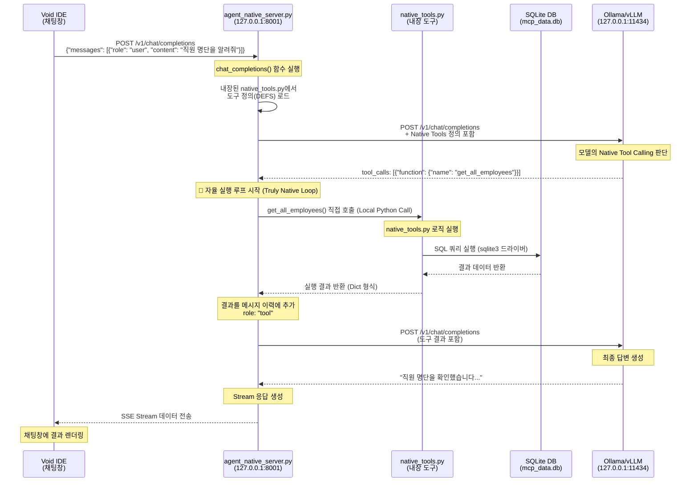

# Native 에이전트 질문 처리 흐름도 (Truly Native 버전)

"직원 명단을 알려줘" 질문이 Void IDE에서 `agent_native`를 거쳐 최종 응답까지 처리되는 전체 흐름을 상세히 설명합니다. `agent_native`는 MCP 서버 없이 **LLM의 Native Tool Calling 능력을 활용하여 파이썬 드라이버로 DB에 직접 접근**합니다.

## 전체 흐름 다이어그램



## 상세 단계별 흐름

### 1️⃣ Void IDE → Agent Native Server
**엔드포인트**: `POST /v1/chat/completions` (Port: 8001)
- 외부 환경 변수나 MCP 브리지 없이, `agent_native` 서버가 직접 요청을 수신합니다.

### 2️⃣ LLM Native Tool Calling (첫 번째 추론)
- `agent_native`는 서버 내부에 정의된 `NATIVE_TOOL_DEFS`를 LLM에게 보냅니다.
- **MCP 브릿지 제거**: 별도의 HTTP 요청이나 SSE 연결 없이 서버 메모리에 로드된 도구 목록을 즉시 사용합니다.

### 3️⃣ Truly Native Loop (독자적 자율 실행)
- **로컬 실행**: LLM이 요청한 도구(`tool_calls`)를 `native_tools.py` 내의 파이썬 함수로 즉시 매핑하여 실행합니다.
- **직접 DB 접근**: 파이썬의 `sqlite3` 드라이버를 사용하여 `mcp_data.db`에 직접 쿼리를 날립니다. 중간에 데이터를 주고받는 MCP 프로토콜 오버헤드가 없습니다.

### 4️⃣ 결과 피드백 및 최종 답변
- 도구 실행 결과를 LLM에게 주입하여 대화를 이어갑니다. 모든 과정은 `agent_native` 서버 내부에서 완결됩니다.

## 구성 요소 비교 (MCP vs Native)

| 기능 | MCP 기반 (`agent_proxy`) | Truly Native (`agent_native`) |
| :--- | :--- | :--- |
| **도구 실행 위치** | 외부 MCP 서버 (Port 3000) | **에이전트 서버 내부 (Local)** |
| **통신 방식** | HTTP/SSE 브릿지 통신 | **직접 파이썬 함수 호출** |
| **데이터 접근** | MCP 서버가 담당 | **에이전트가 직접 DB 드라이버 사용** |
| **속도 및 효율** | 네트워크 오버헤드 존재 | **최소한의 오버헤드, 더 빠른 응답** |

---
## 핵심 구성 파일
- **agent_native_server.py**: 에이전트 핵심 루프 및 서버 엔진 (MCP 클라이언트 제거됨)
- **native_tools.py**: LLM이 호출할 수 있는 로컬 파이썬 함수와 메타데이터 정의
- **agent_native_config.json**: LLM 프로파일 및 에이전트 기본 포트(8001) 설정
---
## 테스트 방법

### 1. 서버 실행
터미널에서 `agent_native` 디렉토리로 이동한 후 서버를 직접 실행합니다.
```bash
python agent_native/agent_native_server.py
```

### 2. API 테스트 (curl)
서버가 실행 중인 상태에서 새로운 터미널을 열고 다음 명령어를 실행하여 에이전트의 자율 동작을 확인할 수 있습니다.
```bash
curl http://localhost:8001/v1/chat/completions \
  -H "Content-Type: application/json" \
  -d '{
    "model": "qwen2.5-coder:7b",
    "messages": [{"role": "user", "content": "직원 명단을 알려줘"}],
    "stream": false
  }'
```

### 3. DB 실행 로그 확인
`agent_native`는 모든 도구 실행과 요청 내역을 텍스트 파일과 SQLite DB에 동시에 기록합니다.

#### 3.1 텍스트 로그 파일 확인
터미널에서 실시간으로 로그가 쌓이는 것을 확인할 수 있습니다.
```bash
# 실시간 로그 모니터링
tail -f agent_native/agent_native.log
```

#### 3.2 SQLite DB 로그 확인
`agent_logs` 테이블에 기록된 상세 이력을 `sqlite3` 명령어로 직접 조회할 수 있습니다.
```bash
# 최근 5개의 로그 이력 확인
sqlite3 db/agent_native_data.db "SELECT * FROM agent_logs ORDER BY timestamp DESC LIMIT 5;"
```

**DB 로그 예시:**
| id | timestamp | request_id | message | details |
| :--- | :--- | :--- | :--- | :--- |
| 74 | 2026-01-12 12:00:02 | 205943 | Native Tool Call: get_all_employees | {} |
| 73 | 2026-01-12 11:59:43 | 205943 | Request Received | 직원 명단 알려줘 |

