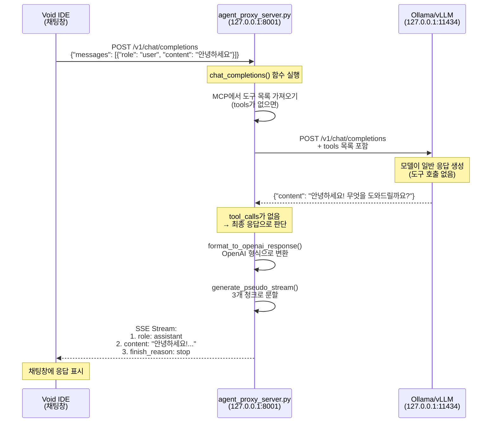

# 일반 질문 처리 흐름도

"안녕하세요" 같은 일반 질문이 Void IDE에서 최종 응답까지 처리되는 전체 흐름을 상세히 설명합니다.

## 전체 흐름 다이어그램



## 상세 단계별 흐름

### 1️⃣ Void IDE → Agent Proxy Server

**파일**: `agent_proxy/agent_proxy_server.py`  
**함수**: `chat_completions()` (118행)

```python
@app.post("/v1/chat/completions")
async def chat_completions(request: ChatRequest):
    request_id = datetime.now().strftime("%H%M%S")
    logger.info(f"📥 [Agent-{request_id}] 새 요청 수신: {request.messages[-1].content}")
    
    current_messages = [msg.model_dump(exclude_none=True) for msg in request.messages]
```

**요청 데이터**:
```json
{
  "messages": [
    {"role": "user", "content": "안녕하세요"}
  ],
  "stream": true
}
```

---

### 2️⃣ Agent Proxy → MCP Server (도구 목록 가져오기)

**파일**: `agent_proxy/agent_proxy_server.py`  
**함수**: `chat_completions()` (130-152행)

```python
# 도구 자동 검색 (요청에 없으면 MCP 서버에서 가져옴)
tools = request.tools
if not tools:
    logger.info(f"🔍 [Agent-{request_id}] MCP 서버에서 도구 목록 가져오는 중...")
    mcp_tools_resp = await httpx.AsyncClient().get(f"{config['mcp']['host']}/tools")
    mcp_tool_defs = mcp_tools_resp.json().get("tools", [])
    
    # MCP 형식을 OpenAI/Ollama 도구 형식으로 변환
    tools = [
        {
            "type": "function",
            "function": {
                "name": t["name"],
                "description": t["description"],
                "parameters": t["inputSchema"]
            }
        }
        for t in mcp_tool_defs
    ]
```

**요청**: `GET http://127.0.0.1:3000/tools`  
**응답**: 4개 도구 정의 (search_docs, get_employee_info, get_all_employees, calculate_vacation_days)

> **💡 중요**: 일반 질문이어도 도구 목록은 항상 LLM에게 전달됩니다. 모델이 "이 질문에는 도구가 필요 없다"고 판단하는 것입니다.

---

### 3️⃣ Agent Proxy → LLM (질문 전달)

**파일**: `agent_proxy/agent_proxy_server.py`  
**함수**: 자율 실행 루프 (159-227행) → `call_llm()` (277행)

```python
# 🔄 Autonomous Agent Loop 시작
for i in range(max_iterations):
    logger.info(f"🔄 [Agent-{request_id}] 반복 {i+1}단계 실행 중...")
    
    # LLM에게 현재까지의 대화 이력 전달
    logger.info(f"📤 [Agent-{request_id}] [LLM REQ] LLM에게 답변 요청 중...")
    full_ollama_resp = await call_llm(current_messages, tools)
```

**`call_llm()` 함수**:
```python
async def call_llm(messages: List[Dict], tools: Optional[List] = None):
    async with httpx.AsyncClient(timeout=config["llm"]["timeout"]) as client:
        url = f"{config['llm']['base_url']}/chat/completions"
        headers = {}
        api_key = str(config["llm"].get("api_key", "")).strip()
        if api_key and api_key.lower() != "not-needed":
            headers["Authorization"] = f"Bearer {api_key}"

        payload = {
            "model": config["llm"]["model"],
            "messages": messages,
            "stream": False,
            "temperature": 0
        }
        if tools:
            payload["tools"] = tools
            
        resp = await client.post(url, json=payload, headers=headers)
        resp.raise_for_status()
        return resp.json()
```

**요청**: `POST http://127.0.0.1:11434/v1/chat/completions`

**요청 페이로드**:
```json
{
  "model": "qwen2.5-coder:7b",
  "messages": [
    {"role": "user", "content": "안녕하세요"}
  ],
  "tools": [
    {"type": "function", "function": {"name": "search_docs", ...}},
    {"type": "function", "function": {"name": "get_employee_info", ...}},
    ...
  ],
  "stream": false,
  "temperature": 0
}
```

---

### 4️⃣ LLM → Agent Proxy (일반 응답)

**LLM 응답**:
```json
{
  "id": "chatcmpl-190",
  "object": "chat.completion",
  "created": 1767701995,
  "model": "qwen2.5-coder:7b",
  "choices": [
    {
      "index": 0,
      "message": {
        "role": "assistant",
        "content": "안녕하세요! 무엇을 도와드릴까요?"
      },
      "finish_reason": "stop"
    }
  ]
}
```

> **💡 핵심**: `tool_calls` 필드가 **없습니다**. 모델이 "이 질문은 도구 없이 답변 가능"하다고 판단했습니다.

---

### 5️⃣ Agent Proxy (응답 처리)

**파일**: `agent_proxy/agent_proxy_server.py`  
**함수**: 자율 실행 루프 (171-227행)

```python
logger.info(f"📥 [Agent-{request_id}] [LLM RESP] 응답 수신 완료")

choice = full_ollama_resp.get("choices", [{}])[0]
message = choice.get("message", {})
tool_calls = message.get("tool_calls", [])  # ← None 또는 []
content = message.get("content", "")

# tool_calls가 없으면 최종 응답으로 판단
if not tool_calls:
    logger.info(f"✅ [Agent-{request_id}] 최종 응답 도달")
    final_resp = format_to_openai_response(full_ollama_resp)
    
    if request.stream:
        logger.info(f"📡 [Agent-{request_id}] 스트리밍 형식으로 변환하여 반환")
        return StreamingResponse(
            generate_pseudo_stream(final_resp),
            media_type="text/event-stream"
        )
    else:
        return final_resp
```

---

### 6️⃣ OpenAI 형식 변환

**파일**: `agent_proxy/agent_proxy_server.py`  
**함수**: `format_to_openai_response()` (355행)

```python
def format_to_openai_response(ollama_resp: Dict):
    """Ollama 응답 형식을 OpenAI 규격으로 변환"""
    choice = ollama_resp.get("choices", [{}])[0]
    message = choice.get("message", {})
    return {
        "id": "agent-" + datetime.now().strftime("%Y%m%d%H%M%S"),
        "object": "chat.completion",
        "created": int(datetime.now().timestamp()),
        "model": ollama_resp.get("model", config["llm"]["model"]),
        "choices": [
            {
                "index": 0,
                "message": {
                    "role": "assistant",
                    "content": message.get("content", "")
                },
                "finish_reason": "stop"
            }
        ],
        "usage": {
            "prompt_tokens": 0,
            "completion_tokens": 0,
            "total_tokens": 0
        }
    }
```

**변환 결과**:
```json
{
  "id": "agent-20260106211900",
  "object": "chat.completion",
  "created": 1767701940,
  "model": "qwen2.5-coder:7b",
  "choices": [{
    "index": 0,
    "message": {
      "role": "assistant",
      "content": "안녕하세요! 무엇을 도와드릴까요?"
    },
    "finish_reason": "stop"
  }],
  "usage": {"prompt_tokens": 0, "completion_tokens": 0, "total_tokens": 0}
}
```

---

### 7️⃣ 스트리밍 형식 변환

**파일**: `agent_proxy/agent_proxy_server.py`  
**함수**: `generate_pseudo_stream()` (304행)

```python
def generate_pseudo_stream(final_resp: Dict):
    """일반 응답을 SSE 스트림 형식으로 변환"""
    # 첫 번째 청크: role만 전송
    chunk1 = {
        "id": final_resp["id"],
        "object": "chat.completion.chunk",
        "created": final_resp["created"],
        "model": final_resp["model"],
        "choices": [
            {
                "index": 0,
                "delta": {"role": "assistant"},
                "finish_reason": None
            }
        ]
    }
    yield f"data: {json.dumps(chunk1, ensure_ascii=False)}\\n\\n"
    
    # 두 번째 청크: content 전송
    chunk2 = {
        "id": final_resp["id"],
        "object": "chat.completion.chunk",
        "created": final_resp["created"],
        "model": final_resp["model"],
        "choices": [
            {
                "index": 0,
                "delta": {"content": final_resp["choices"][0]["message"]["content"]},
                "finish_reason": None
            }
        ]
    }
    yield f"data: {json.dumps(chunk2, ensure_ascii=False)}\\n\\n"
    
    # 세 번째 청크: finish_reason
    chunk3 = {
        "id": final_resp["id"],
        "object": "chat.completion.chunk",
        "created": final_resp["created"],
        "model": final_resp["model"],
        "choices": [
            {
                "index": 0,
                "delta": {},
                "finish_reason": "stop"
            }
        ]
    }
    yield f"data: {json.dumps(chunk3, ensure_ascii=False)}\\n\\n"
    yield "data: [DONE]\\n\\n"
```

---

### 8️⃣ Agent Proxy → Void IDE (SSE 스트림 전송)

**SSE 스트림**:
```
data: {"id":"agent-20260106211900","object":"chat.completion.chunk","created":1767701940,"model":"qwen2.5-coder:7b","choices":[{"index":0,"delta":{"role":"assistant"},"finish_reason":null}]}

data: {"id":"agent-20260106211900","object":"chat.completion.chunk","created":1767701940,"model":"qwen2.5-coder:7b","choices":[{"index":0,"delta":{"content":"안녕하세요! 무엇을 도와드릴까요?"},"finish_reason":null}]}

data: {"id":"agent-20260106211900","object":"chat.completion.chunk","created":1767701940,"model":"qwen2.5-coder:7b","choices":[{"index":0,"delta":{},"finish_reason":"stop"}]}

data: [DONE]
```

---

### 9️⃣ Void IDE (최종 렌더링)

Void IDE가 SSE 스트림을 수신하여 채팅창에 메시지를 점진적으로 표시합니다.

**최종 화면**:
```
안녕하세요! 무엇을 도와드릴까요?
```

---

## MCP 질문 흐름과의 차이점

| 단계 | 일반 질문 | MCP 질문 (도구 사용) |
|------|----------|---------------------|
| **LLM 호출 횟수** | **1회** | **2회 이상** (도구 결과 반영) |
| **MCP 서버 호출** | ❌ 없음 | ✅ 있음 (도구 실행) |
| **자율 루프 반복** | 1회만 (즉시 종료) | 여러 번 (도구 결과 반영) |
| **응답 시간** | 빠름 (~2초) | 느림 (~5-10초) |

---

## 핵심 포인트 정리

### 🚀 빠른 응답 경로
일반 질문은 **MCP 서버를 거치지 않고** Agent Proxy ↔ LLM만 왕복하므로 매우 빠릅니다.

### 🔄 자율 루프의 조기 종료
`tool_calls`가 없으면 루프가 **첫 번째 반복에서 즉시 종료**됩니다.

### 📡 스트리밍 일관성
일반 질문도 도구 질문과 **동일한 3청크 스트리밍 형식**을 사용하여 Void IDE의 렌더링 로직을 단순화합니다.

### 🛠️ 도구 목록은 항상 전달
일반 질문이어도 LLM에게 **도구 목록을 함께 전달**합니다. 이는 모델이 "필요하면 도구를 쓸 수 있다"는 선택권을 주기 위함입니다.
